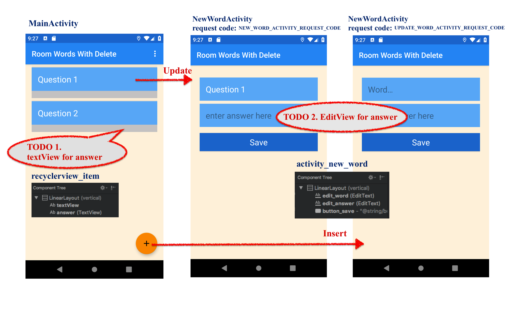
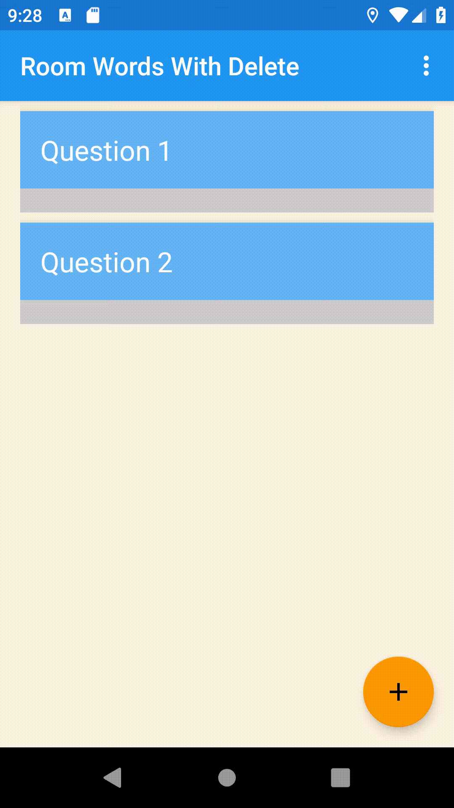

# AAD_HW10

This repository include **starter code**, **Espresso AndroidTest** and **Travis setting**, which are used for automatically grading in **Android Application Development course in National Cheng Kung University (NCKU)** in 2019 Spring Semester.

Materials:
- **Lesson 10: Storing data with Room** in Codelabs for Android Developer Fundamentals (V2). 
<https://developer.android.com/courses/fundamentals-training/toc-v2>

Feel free to fork this repository if you are also working on this codelab and want to testing your answer.
For more instructions, please follow the [homework rules slides](https://github.com/ncku-csie/AAD_HW01/blob/master/Homework%20Rules.pdf). 
If you have further questions, please contact android@imslab.org

These test cases are written by Intelligent Mobile Service laboratory and Cyber Physical System Laboratory in NCKU.

---

Please follow the instructions on the **Homework** sections in these codelabs.

- [10.1 Part A: Room, LiveData, and ViewModel](https://codelabs.developers.google.com/codelabs/android-training-livedata-viewmodel/#18)
- [10.1 Part B: Deleting data from a Room database](https://codelabs.developers.google.com/codelabs/android-training-room-delete-data/index.html?index=..%2F..%2Fandroid-training#12)

## Part 1. Questions (40 pt)
Please submit your answer on moodle.
<https://moodle.ncku.edu.tw/course/view.php?id=104771>

**[Notice]** 
- You only have **one chance** to submit your answer.
- There are two Questionnaire in this Homework (20 pt for each)

| Codelab | Questions | Questionnaire Name |
| --- | ----------- | ---------|
| 10.1 Part A | 4 Questions | Homework 10 |
| 10.1 Part B | 2 Questions | Homework 10 |
| 10.1 Part B | 6 Matching Question | Homework 10.1 Part B - codelab |

## Part 2. Android Tests (60 pt)

Please submit your code to the **master** branch in this repository for grading.

<table>
    <thead>
        <tr>
            <th>Codelab</th>
            <th>Starter Project</th>
            <th>Test File</th>
            <th>Questions</th>
            <th>Points</th>
        </tr>
    </thead>
    <tbody>
        <tr>
            <td rowspan=4>10.1</td>
            <td rowspan=4>RoomWordsWithDelete</td>
            <td rowspan=4>RoomDatabaseTest</td>
            <td>testAnswerLayout</td>
            <td>15 pt</td>
        </tr>
        <tr>
            <td>testInsertData</td>
            <td>15 pt</td>
        </tr>
        <tr>
            <td>testUpdateAnswer</td>
            <td>15 pt</td>
        </tr>
        <tr>
            <td>testRestoreData</td>
            <td>15 pt</td>
        </tr>
    </tbody>
</table>

### solution sample
|test name |solution |
|----|----|
|testAnswerLayout|  |
|testInsertData |  |
|testUpdateAnswer | |
|testRestoreData | |

**[Notice]** 
- Please do not modify the following files:
    - .travis.yml
    - <Project>/app/src/androidTest/*
    - gradle files
- Once any modifications or any cheating behavior are detected, you will got 0 pt for this homework.
- Creating a new branch to develop and testing locally are highly recommended.
